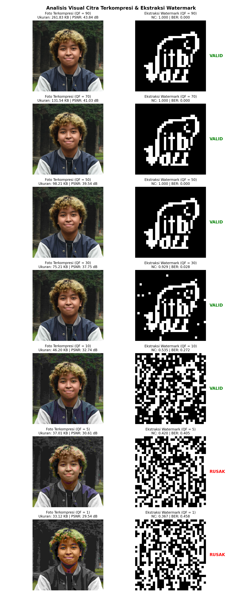
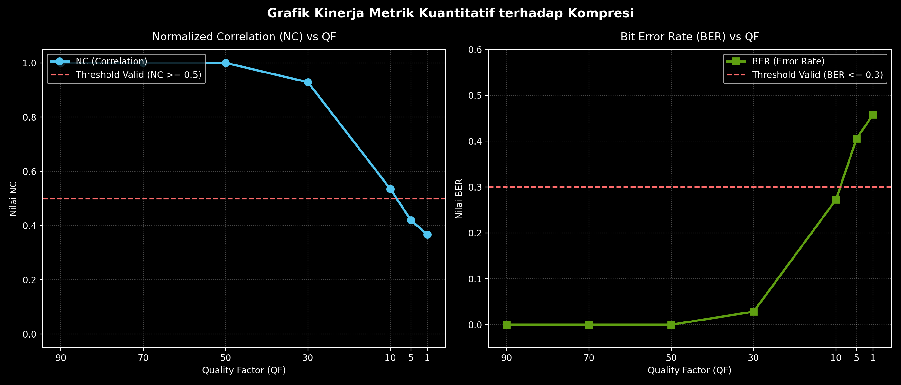

# Tugas Watermarking Foto Wajah & Evaluasi Kompresi JPEG

Repositori ini dibuat untuk memenuhi tugas mata kuliah Multimedia / Pengolahan Citra Digital. Proyek ini mengimplementasikan teknik *Informed Digital Image Watermarking* pada domain frekuensi (DCT), serta menguji ketahanannya terhadap gangguan kompresi JPEG dengan berbagai Quality Factor (QF).

## 🌟 Fitur Utama
- Konversi ruang warna ke kanal **YUV (Luminance Y)** untuk minimalkan persepsi perubahan visual.
- Penyisipan bit biner ($32 \times 32$) pada koefisien frekuensi menengah DCT `[0,1]` dan `[1,0]`.
- Pengujian otomatis ketahanan watermark menggunakan parameter **Quality Factor (QF)**: 90, 70, 50, 30, 10, 5, dan 1.
- Evaluasi metrik performa kuantitatif: **Normalized Correlation (NC)**, **Bit Error Rate (BER)**, dan **PSNR**.

## 📂 Struktur Repositori

```
tugas-watermarking-jpeg/
│
├── data/
│   ├── input/
│   │   ├── wajah.JPG              # Foto wajah asli Anda (taruh di sini)
│   │   └── watermark.png          # Logo biner asli (ITB Jazz / R)
│   │
│   └── output/
│       ├── wajah_watermarked.jpg  # Hasil citra setelah disisipkan watermark
│       ├── compressed_qf_90.jpg   # Hasil kompresi berbagai QF
│       ├── compressed_qf_70.jpg
│       └── ...
│
├── src/
│   ├── __init__.py
│   ├── embedding.py               # Fungsi `embed_watermark`
│   ├── extraction.py              # Fungsi `extract_watermark_from_images`
│   └── main.py                    # Skrip utama untuk menjalankan eksperimen & grafik
│
├── reports/
│   ├── grafik_kinerja_dark.png
│   └── analisis_visual.png
│
├── .gitignore
├── README.md
└── requirements.txt
```

## 🚀 Cara Menjalankan Kode

### Prasyarat
Pastikan Anda sudah memasang Python 3.8+ dan dependensi:

```bash
pip install -r requirements.txt
```

### Menjalankan eksperimen

1. Letakkan `wajah.JPG` dan `watermark.png` di folder `data/input/`.
2. Jalankan skrip utama:

```bash
python src/main.py
```

Hasil citra akan disimpan di `data/output/` dan grafik performa akan tersimpan di `reports/`.

## 📊 Interpretasi Singkat Hasil
- Watermark biner (32×32) diekstrak dan dinilai menggunakan NC/BER.
- Threshold sederhana: `NC >= 0.5` dan `BER <= 0.3` dianggap `VALID`.
- Eksperimen tipikal menunjukkan watermark bertahan sampai QF rendah tertentu, sedangkan QF sangat kecil (mis. 5 atau 1) biasanya merusak (BER tinggi).

## Cara Kerja Program

1. Watermarking

	- Preprocessing
		Manipulasi gambar wajah agar bisa dibagi menjadi blok matriks 32 x 32 pixel.

		```python
		h, w, c = cover.shape
		h_new, w_new = (h // 32) * 32, (w // 32) * 32
		cover_resized = cv2.resize(cover, (w_new, h_new))
		```

	- Binerisasi watermark
		Mengubah watermark agar hanya bernilai 0 (hitam) atau 1 (putih) dengan ukuran patokan 32 x 32 pixel.

		```python
		wm_resized = cv2.resize(wm, (32, 32), interpolation=cv2.INTER_NEAREST)
		_, wm_binary = cv2.threshold(wm_resized, 127, 1, cv2.THRESH_BINARY)
		```

	- Konversi warna ke YUV
		Gambar wajah dikonversi dari RGB ke YUV (Y merepresentasikan intensitas kecerahan). Penyisipan watermark dilakukan pada kanal Y.

		```python
		yuv = cv2.cvtColor(cover_resized, cv2.COLOR_BGR2YUV)
		y, u, v = cv2.split(yuv)
		```

	- Pembagian blok
		Gambar dibagi menjadi matriks blok 32 x 32.

		```python
		y_float = y.astype(np.float32)
		block_h, block_w = h_new // 32, w_new // 32
		```

	- Penyisipan bit watermark (domain DCT)
		Setiap blok diubah ke domain frekuensi menggunakan DCT. Bit watermark (0 atau 1) disisipkan dengan cara mengubah selisih nilai koefisien frekuensi menengah.

		```python
		for i in range(32):
			for j in range(32):
				by, bx = i * block_h, j * block_w

				block_orig = y_orig_f[by:by+block_h, bx:bx+block_w]
				block_wm = y_wm_f[by:by+block_h, bx:bx+block_w]

				block_dct = cv2.dct(block_wm)

				if wm_binary[i, j] == 1:
					block_dct[0, 1] += alpha
					block_dct[1, 0] -= alpha
				else:
					block_dct[0, 1] -= alpha
					block_dct[1, 0] += alpha

				y_float[by:by+block_h, bx:bx+block_w] = cv2.idct(block_dct)
		```

	- Rekonstruksi RGB

		```python
		y_watermarked = np.clip(y_float, 0, 255).astype(np.uint8)
		yuv_watermarked = cv2.merge((y_watermarked, u, v))
		watermarked_image = cv2.cvtColor(yuv_watermarked, cv2.COLOR_YUV2BGR)
		```

	- Visualisasi embedding (langkah output)

		- `data/output/cover_y_channel.png`

			

		- `data/output/watermark_binary.png`

			

		- `data/output/watermarked_y_channel.png`

			

	- Contoh file (input / output)

		- Wajah (input): data/input/wajah.JPG
        
			

		- Watermark (input): data/input/watermark.png

			

		- Hasil watermarked: data/output/wajah_watermarked.jpg

			


2. Kompresi gambar

	- Citra yang mengandung watermark disimpan ke dalam format `.jpg` menggunakan parameter `cv2.IMWRITE_JPEG_QUALITY` untuk Quality Factor (QF).

		```python
		for qf in quality_factors:
			compressed_filename = output_dir / f'compressed_qf_{qf}.jpg'
			cv2.imwrite(str(compressed_filename), img_watermarked, [int(cv2.IMWRITE_JPEG_QUALITY), qf])
		```

	- Semua hasil kompresi (contoh)

	- `data/output/compressed_qf_90.jpg`

		

	- `data/output/compressed_qf_70.jpg`

		

	- `data/output/compressed_qf_50.jpg`

		

	- `data/output/compressed_qf_30.jpg`

		

	- `data/output/compressed_qf_10.jpg`

		

	- `data/output/compressed_qf_5.jpg`

		

	- `data/output/compressed_qf_1.jpg`

		

3. Ekstraksi watermark

	- Baca gambar asli dan pisahkan kanal Y.

		```python
		yuv_orig = cv2.cvtColor(cover_resized, cv2.COLOR_BGR2YUV)
		y_orig, _, _ = cv2.split(yuv_orig)
		```

	- Baca gambar terkompresi dan pisahkan kanal Y.

		```python
		yuv_wm = cv2.cvtColor(wm_img_resized, cv2.COLOR_BGR2YUV)
		y_wm, _, _ = cv2.split(yuv_wm)
		```

	- Metode informed watermarking
		Bandingkan koefisien DCT pada foto terkompresi dengan koefisien DCT pada foto asli sebelum di-watermark.

		```python
		dct_orig = cv2.dct(block_orig)
		dct_wm = cv2.dct(block_wm)

		diff_01 = dct_wm[0, 1] - dct_orig[0, 1]
		diff_10 = dct_wm[1, 0] - dct_orig[1, 0]

		if diff_01 - diff_10 > 0:
			extracted_wm[i, j] = 1
		else:
			extracted_wm[i, j] = 0
		```

	- Hasil visualisasi ekstraksi

		- `reports/analisis_visual.png`

			

4. Evaluasi kinerja (QF)

	- Normalized Correlation (NC)

		```python
		numerator = np.sum(wm_orig_binary * extracted_wm_binary)
		denominator = np.sqrt(np.sum(wm_orig_binary**2) * np.sum(extracted_wm_binary**2))
		nc = numerator / denominator if denominator != 0 else 0
		nc_values.append(float(nc))
		```

	- Bit Error Rate (BER)

		```python
		ber = np.sum(wm_orig_binary != extracted_wm_binary) / wm_orig_binary.size
		ber_values.append(float(ber))
		```

	- Peak Signal-to-Noise Ratio (PSNR)

		```python
		mse_c = np.mean((img_orig_cropped - cv2.resize(img_compressed, (w_n, h_n))) ** 2)
		psnr_c = 20 * np.log10(255.0 / np.sqrt(mse_c)) if mse_c != 0 else 100
		psnr_values.append(float(psnr_c))
		```

	- Penentuan status. Threshold NC di angka 0.5 berarti kemiripan gambar hasil ekstraksi masih di atas 50% sehingga bentuk watermark masih dapat dikenali. Sementara, threshold BER di angka 30% karena jika bit yang rusak sudah menembus angka 30%, algoritma rekonstruksi visual atau mata manusia umumnya sudah tidak mampu lagi mengenali watermark biner yang disisipkan.

		```python
		status = "VALID" if (nc >= 0.5 and ber <= 0.3) else "RUSAK"
		```

5. Visualisasi hasil

	- Menampilkan citra terkompresi dan hasil ekstraksi watermark per QF, menyimpan grafik di `reports/analisis_visual.png`.

		```python
		plt.style.use('default')
		n = len(quality_factors)
		fig_img, axes = plt.subplots(n, 2, figsize=(10, 3.5 * n))
		fig_img.suptitle('Analisis Visual Citra Terkompresi & Ekstraksi Watermark', fontsize=14, fontweight='bold', y=0.99)

		for idx, qf in enumerate(quality_factors):
			img_c = compressed_images[idx]
			wm_bin = extracted_wms[idx]
			psnr_c = psnr_values[idx]
			file_size = file_sizes[idx]
			nc = nc_values[idx]
			ber = ber_values[idx]
			status = "VALID" if (nc >= 0.5 and ber <= 0.3) else "RUSAK"
			color_status = 'green' if status == 'VALID' else 'red'

			ax_l = axes[idx, 0] if n > 1 else axes[0]
			img_rgb = cv2.cvtColor(img_c, cv2.COLOR_BGR2RGB)
			ax_l.imshow(img_rgb)
			ax_l.set_title(f"Foto Terkompresi (QF = {qf})\nUkuran: {file_size:.2f} KB | PSNR: {psnr_c:.2f} dB", fontsize=10)
			ax_l.axis('off')

			ax_r = axes[idx, 1] if n > 1 else axes[1]
			ax_r.imshow(wm_bin * 255, cmap='gray')
			ax_r.set_title(f"Ekstraksi Watermark (QF = {qf})\nNC: {nc:.3f} | BER: {ber:.3f}", fontsize=10)
			ax_r.text(1.05, 0.5, status, transform=ax_r.transAxes, color=color_status, fontweight='bold', fontsize=12, va='center')
			ax_r.axis('off')

		plt.tight_layout()
		fig_img.savefig(str(reports_dir / 'analisis_visual.png'), dpi=200)
		print('Gambar analisis visual disimpan di `reports/analisis_visual.png`.')
		```
	- Grafik kinerja

		- `reports/grafik_kinerja_dark.png`

			

